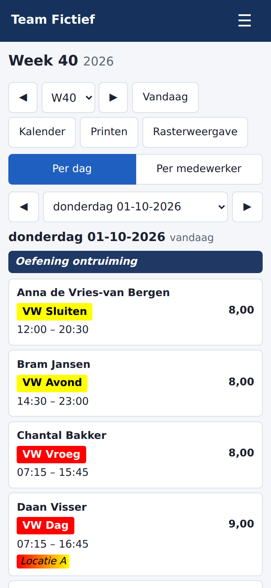
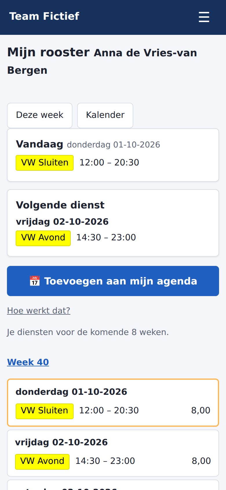

# Beveiligingsrooster

Een eigen webapplicatie voor het jaarrooster en de urenregistratie van een beveiligingsteam (ongeveer 10–15 collega's). Hij vervangt het oude Excel-bestand met macro's (`Rooster_2026.xlsm`) en draait **self-hosted in Docker**, bijvoorbeeld in een LXC-container op Proxmox met Alpine of Debian.

> **Privacy:** deze repository bevat geen namen, roosters of wachtwoorden. Alle roosterdata staat alleen op je eigen server, in de map `data/`.

<p>
  
  
  
</p>

Meer schermafbeeldingen (telefoon 390×844 en computer 1280×800) staan in [docs/schermafbeeldingen](docs/schermafbeeldingen).

---

## Inhoud

1. [Wat doet de app?](#wat-doet-de-app)
2. [Hoe werkt het?](#hoe-werkt-het)
3. [Installeren](#installeren)
4. [Het docker-compose-bestand (om te kopiëren)](#het-docker-compose-bestand-om-te-kopiëren)
5. [Eerste setup](#eerste-setup)
6. [Dagelijks gebruik en beheer-commando's](#dagelijks-gebruik-en-beheer-commandos)
7. [Bijwerken](#bijwerken)
8. [Back-ups en terugzetten](#back-ups-en-terugzetten)
9. [Bereikbaarheid en HTTPS](#bereikbaarheid-en-https)
10. [Telefoon, app en API](#telefoon-app-en-api)
11. [Debuglog](#debuglog)
12. [Veelgestelde problemen](#veelgestelde-problemen)
13. [Ontwikkelen](#ontwikkelen)

---

## Wat doet de app?

| Onderdeel | Wat je ermee doet | Status |
|---|---|---|
| **Inloggen en rollen** | Beheerder (planner) mag alles; gebruiker (collega) mag alleen kijken, printen en exporteren | ✅ |
| **Setup-wizard** | Eerste beheerder, instellingen, dienstcodes en medewerkers invoeren | ✅ |
| **Beheer** | Medewerkers (met contracturen per jaar), dienstcodes met kleuren, vakanties, feestdagen, accounts en instellingen | ✅ |
| **Urenberekening** | Precies zoals de oude Excel-VBA: pauze-aftrek, toeslag voor zaterdag en zondag, afronding op kwartieren | ✅ |
| **Weekrooster** | Het code-raster zoals in Excel: typ een dienstcode, dan verschijnen tijden en uren vanzelf. Twee diensten op één dag: typ `4/7` | ✅ |
| **Kalender, urenoverzicht, zoeken, logboek, printen** | De overzichten uit het Excel-bestand; de print van het weekrooster lijkt op het papieren rooster (A4 liggend, in kleur) | ✅ |
| **Google Agenda en ICS-feed** | Diensten verschijnen automatisch in de agenda van de collega | ✅ |
| **Excel-import en back-ups in de webinterface** | Het oude `.xlsm` inlezen (met droogloop en controle van de weektotalen); back-ups downloaden en terugzetten | ✅ |
| **Telefoon en app** | Elke pagina werkt op de telefoon; *Mijn rooster* en het weekrooster zijn voor de telefoon gemaakt; de planner wijzigt een dienst met één tik. Te installeren als app (PWA) | ✅ |
| **API voor een app** | `/api/v1` (alleen lezen) met persoonlijke API-tokens, zie [docs/api.md](docs/api.md) | ✅ |

## Hoe werkt het?

```
                 ┌──────────────────── Docker-host (LXC: Alpine of Debian) ─────────────────────┐
 browser ──────► │  container "web"     Flask-app + Gunicorn op poort 8000                     │
 (LAN/proxy)     │        │              - toont de pagina's, controleert rechten               │
                 │        ▼              - rekent de uren uit bij het opslaan                   │
                 │   ./data/rooster.db  (SQLite-database, back-ups, geheime sleutel)            │
                 │        ▲                                                                     │
                 │  container "worker"  achtergrondtaken: agenda-synchronisatie, logboek        │
                 │                      opschonen (dagelijks), back-up (elke nacht na 02:00)    │
                 └──────────────────────────────────────────────────────────────────────────────┘
```

- **Twee containers, één image.** `web` bedient de website. `worker` doet de achtergrondtaken. Beide gebruiken dezelfde map `./data`.
- **Alles staat in `./data`**, naast `docker-compose.yml`:
  - `rooster.db` is de database;
  - `backups/` bevat de nachtelijke back-ups;
  - `secret_key` wordt automatisch aangemaakt;
  - `google-service-account.json` is het Google-sleutelbestand (alleen als je de agenda-koppeling gebruikt);
  - `logs/debug.log` is de debuglog (alleen met `DEBUG_LOG=1`, zie [Debuglog](#debuglog));
  - `import/` bevat tijdelijk een geüpload Excel-bestand (wordt na de import, of na een dag, opgeruimd).

  Een back-up van deze map (of van de hele LXC met Proxmox) is dus genoeg.
- **Bij elke start** werkt de `web`-container de database automatisch bij (migraties). Daarna start de webserver.
- **Rechten worden op de server gecontroleerd.** Een gewone gebruiker krijgt bij elke wijzigpoging een foutmelding (HTTP 403), ook als hij de knoppen omzeilt. Dit staat vast in de tests.
- **Geen wachtwoorden in platte tekst.** Wachtwoorden worden versleuteld opgeslagen (argon2). Zie [Inlogblokkade](#inlogblokkade-en-reverse-proxy) voor de beperking van foute pogingen.
- **Sessies.** Na het wijzigen of resetten van een wachtwoord, het deactiveren van een account of een rolwijziging zijn alle andere sessies van die gebruiker direct ongeldig. Na het terugzetten van een back-up moet iedereen opnieuw inloggen.
- **Urenberekening** (per dienst, alleen over begin- en eindtijd; bij twee diensten op een dag telt elke dienst apart):
  1. Eindtijd vóór de begintijd? Dan loopt de dienst door na middernacht.
  2. Meer dan 5,5 uur? Dan gaat er 0,5 uur pauze af.
  3. Daarna × de toeslagfactor: zaterdag 1,5 en zondag 2,0 (instelbaar).
  4. Tot slot afronden op kwartieren, op precies dezelfde manier als Excel. Gecontroleerd op 1899 diensten uit het oude bestand.

## Installeren

Je hebt een Linux-machine met Docker nodig. De aanbevolen opzet is een **LXC-container op Proxmox**. Daarvoor zijn er drie manieren, van makkelijk naar handmatig.

### Manier 1: alles automatisch vanaf de Proxmox-host

Log in op de Proxmox-host (shell) en voer uit:

```sh
wget -qO- https://raw.githubusercontent.com/Sarnog/Beveiligingsrooster/main/scripts/proxmox-maak-lxc.sh | sh
```

Dit maakt een LXC met Alpine (of `OS=debian`), zet Docker erin, start de app en toont de setup-code. Details en opties staan in [docs/proxmox-lxc.md](docs/proxmox-lxc.md).

### Manier 2: in een bestaande LXC of server (Alpine of Debian)

Als root in de container:

```sh
wget -qO- https://raw.githubusercontent.com/Sarnog/Beveiligingsrooster/main/install.sh | sh
```

Het script installeert Docker en maakt `/opt/beveiligingsrooster` aan met `docker-compose.yml` en `.env`. Daarna start het de app en toont het de URL en de setup-code.

> Draai je een LXC op Proxmox? Zet dan bij de container **Options → Features → Nesting** (en **keyctl**) aan, anders start Docker niet.

### Manier 3: met de hand (je hebt al Docker)

Maak een map aan, bijvoorbeeld `/opt/beveiligingsrooster`. Zet daarin het bestand hieronder als `docker-compose.yml` en start:

```sh
mkdir -p /opt/beveiligingsrooster && cd /opt/beveiligingsrooster
nano docker-compose.yml        # plak de inhoud van hieronder
docker compose up -d
docker compose logs web | grep -i setup-code
```

Open daarna `http://<ip-van-de-server>:8000/setup`.

## Het docker-compose-bestand (om te kopiëren)

Dit is precies hetzelfde bestand als [`docker-compose.yml`](docker-compose.yml) in de repository. Je hoeft niets aan te passen: zonder instellingen werkt het meteen, en de geheime sleutel wordt vanzelf aangemaakt.

```yaml
services:
  web:
    image: ghcr.io/sarnog/beveiligingsrooster:latest
    container_name: beveiligingsrooster
    command: web
    init: true  # kleine init als PID 1: geeft 'docker stop' netjes door
    restart: unless-stopped
    ports:
      # 0.0.0.0 = bereikbaar in het LAN; 127.0.0.1 = alleen via een reverse proxy op deze host
      - "${LUISTER_ADRES:-0.0.0.0}:${POORT:-8000}:8000"
    environment:
      TZ: Europe/Amsterdam
      BASE_URL: ${BASE_URL:-}                   # bijv. https://rooster.voorbeeld.nl
      PROXY_VERTROUWEN: ${PROXY_VERTROUWEN:-0}  # 1 als er een reverse proxy/tunnel voor staat
      SECRET_KEY: ${SECRET_KEY:-}               # leeg = automatisch aangemaakt in ./data
      SESSIE_UREN: ${SESSIE_UREN:-12}
      LOG_NIVEAU: ${LOG_NIVEAU:-INFO}           # DEBUG voor meer details in 'docker compose logs'
      DEBUG_LOG: ${DEBUG_LOG:-0}                # 1 = alles ook naar ./data/logs/debug.log
    volumes:
      - ./data:/data
    healthcheck:
      test: ["CMD", "python", "-c", "import urllib.request; urllib.request.urlopen('http://127.0.0.1:8000/health', timeout=5)"]
      interval: 30s
      timeout: 10s
      retries: 3
      start_period: 30s

  worker:
    image: ghcr.io/sarnog/beveiligingsrooster:latest
    container_name: beveiligingsrooster-worker
    command: worker
    init: true
    restart: unless-stopped
    environment:
      TZ: Europe/Amsterdam
      BASE_URL: ${BASE_URL:-}
      SECRET_KEY: ${SECRET_KEY:-}
      LOG_NIVEAU: ${LOG_NIVEAU:-INFO}           # DEBUG voor meer details in 'docker compose logs'
      DEBUG_LOG: ${DEBUG_LOG:-0}                # 1 = alles ook naar ./data/logs/debug.log
    volumes:
      - ./data:/data
    depends_on:
      web:
        condition: service_healthy   # eerst moet de database bijgewerkt zijn
```

**Instellingen aanpassen.** Zet een bestand `.env` naast `docker-compose.yml` (voorbeeld: [`.env.voorbeeld`](.env.voorbeeld)):

| Variabele | Standaard | Betekenis |
|---|---|---|
| `LUISTER_ADRES` | `0.0.0.0` | `127.0.0.1` als alleen een reverse proxy op dezelfde host erbij mag |
| `POORT` | `8000` | Poort op de host |
| `BASE_URL` | leeg | Openbaar adres, bijvoorbeeld `https://rooster.voorbeeld.nl`. Zet bij HTTPS ook de `Secure`-cookies aan |
| `PROXY_VERTROUWEN` | `0` | `1` achter Caddy, Cloudflare Tunnel of Tailscale |
| `SESSIE_UREN` | `12` | Hoe lang je ingelogd blijft |
| `SECRET_KEY` | leeg | Leeg laten; wordt dan bewaard in `data/secret_key` |
| `LOG_NIVEAU` | `INFO` | Wat er in `docker compose logs` komt: `DEBUG`, `INFO`, `WARNING` of `ERROR` |
| `DEBUG_LOG` | `0` | `1` = debuglog aan, zie [Debuglog](#debuglog) |
| `COOKIE_SECURE` | volgt `BASE_URL` | `1` = sessiecookie alleen via HTTPS, `0` = ook via HTTP. Standaard aan als `BASE_URL` met `https://` begint. Als dit aan staat, stuurt de app ook `Strict-Transport-Security` mee (de browser gebruikt dan een jaar lang alleen HTTPS voor dit adres) |
| `TZ` | `Europe/Amsterdam` | Standaardtijdzone. De instelling *Tijdzone* in Beheer → Instellingen gaat voor; die geldt voor de klok, de ICS-feed en Google Agenda |
| `GUNICORN_WORKERS` / `GUNICORN_THREADS` | `2` / `4` | Aantal webserverprocessen en threads per proces. Ruim genoeg voor 10–15 collega's |
| `DATABASE_URL` | SQLite in `./data` | Alleen voor ontwikkelaars. Back-ups, terugzetten en de feestdagenlogica werken alleen met SQLite; gebruik dit dus niet in productie |

`TZ`, `COOKIE_SECURE` en de `GUNICORN_*`-variabelen staan niet in het standaardbestand. Voeg ze zo nodig toe onder `environment:` van de `web`-container (en `TZ` ook bij `worker`).

**Zelf de image bouwen** (in plaats van downloaden), vanuit een kopie van de repository:

```sh
docker compose -f docker-compose.yml -f docker-compose.bouwen.yml up -d --build
```

> **Voor de eigenaar van de repository: alleen `main` maakt releases.**
> - Een push naar een andere branch, of een pull request, draait alleen de controles (lint, tests, databasemigraties, een proefbouw van de image). Er wordt dan **niets** gepubliceerd.
> - Een push naar `main` (in de praktijk: een pull request mergen) publiceert de image `latest` op `ghcr.io/sarnog/beveiligingsrooster`.
> - Staat er in `app/__init__.py` een `VERSIE` waarvoor nog geen tag `v<VERSIE>` bestaat, dan maakt de workflow op `main` ook de image `<VERSIE>`, de tag en een GitHub-release met de tekst uit `CHANGELOG.md`.
> - Een release maken is dus: in een branch `VERSIE` ophogen (ook `SCRIPT_VERSIE` in `app/static/js/raster.js`), `CHANGELOG.md` bijwerken, pull request maken en mergen.
> - Is de app-code op `main` gewijzigd zonder dat `VERSIE` omhoog ging, dan faalt de workflow met een duidelijke melding.
>
> Een nieuw pakket is op GitHub eerst **privé**. Zet het één keer op openbaar: *GitHub → je profiel → Packages → beveiligingsrooster → Package settings → Change visibility → Public*. Lukt het downloaden niet, dan bouwt `install.sh` de image automatisch zelf.

## Eerste setup

1. Open `http://<ip>:8000/setup`.
2. Vul de **setup-code** in. Die staat in de uitvoer van `install.sh`, of vraag hem op met:
   ```sh
   docker compose exec -u rooster web flask setup-code
   ```
   Door deze code kan een willekeurige bezoeker de installatie niet overnemen.
3. Doorloop de wizard:
   1. beheerdersaccount;
   2. algemene instellingen (teamnaam, toeslagfactoren, bewaartermijn logboek);
   3. dienstcodes: leeg beginnen of het **voorbeeldpakket** laden;
   4. medewerkers (mag ook later);
   5. afronden.

Daarna is `/setup` niet meer bereikbaar en is de code ongeldig.

**Accounts voor collega's** maak je aan via *Beheer → Gebruikers*. Er is geen openbare registratie. Bij de eerste login kiest de collega zelf een nieuw wachtwoord. Koppel het account aan een medewerker, dan ziet die collega direct zijn of haar eigen rooster.

## Het oude Excel-rooster overzetten

*Beheer → Excel-import* leest het oude `Rooster_2026.xlsm` in. Dat zijn:
- medewerkers en contracturen;
- dienstcodes en toeslagen;
- vakanties;
- alle weken met diensten, tijden, opmerkingen en dagopmerkingen.

Je krijgt eerst een **droogloop** met een voorbeeld en een controle van alle weektotalen tegen kolom Z in Excel. Pas na bevestiging wordt er iets opgeslagen, en de app maakt daarvóór automatisch een back-up.

Wachtwoorden en rechten uit het Excel-bestand worden **niet** overgenomen. Het geüploade bestand wordt na afloop direct verwijderd.

## Dagelijks gebruik en beheer-commando's

Voer deze commando's uit in de map met `docker-compose.yml`:

| Wat | Commando |
|---|---|
| Status | `docker compose ps` |
| Logs bekijken | `docker compose logs -f` |
| Stoppen / starten | `docker compose stop` / `docker compose start` |
| Setup-code tonen | `docker compose exec -u rooster web flask setup-code` |
| **Wachtwoord vergeten** | `docker compose exec -u rooster web flask reset-wachtwoord <gebruikersnaam>` |
| **Buitengesloten: nieuwe beheerder** | `docker compose exec -u rooster web flask maak-beheerder` |
| Nu een back-up maken | `docker compose exec -u rooster web flask backup` |
| Back-up terugzetten (noodgeval) | `docker compose exec -u rooster web flask terugzetten rooster-JJJJMMDD-HHMMSS.db` |
| Alle uren herberekenen | `docker compose exec -u rooster web flask herbereken-uren` |

Gebruik altijd `-u rooster`. Dan zijn nieuwe bestanden in `./data` van de app-gebruiker en niet van root.

## Bijwerken

```sh
cd /opt/beveiligingsrooster && ./update.sh
```

`update.sh` doet het volgende:
1. het maakt eerst een back-up (`data/backups/rooster-…-voor-update.db`);
2. het haalt de nieuwe image op;
3. het herstart de containers.

De database wordt bij het starten automatisch bijgewerkt. `./data` en `.env` blijven altijd ongemoeid.

Zonder script kan het ook met de hand: `docker compose pull && docker compose up -d`.

### Terug naar de vorige versie (na een mislukte update)

Start de app na een update niet meer (`docker compose ps` toont `web` niet als *healthy*, of `docker compose logs web` toont een fout bij "Database bijwerken")? Ga dan zo terug:

1. Zoek de versie die je had in het CHANGELOG of op GitHub (bijvoorbeeld `1.1.2`).
2. Zet in `docker-compose.yml` bij **beide** containers `image: ghcr.io/sarnog/beveiligingsrooster:1.1.2` (in plaats van `latest`).
3. Zet de database terug van vóór de update (een nieuwere versie kan het databaseschema al hebben bijgewerkt):
   ```sh
   docker compose down
   ls data/backups/*-voor-update.db          # kies de nieuwste
   cp data/backups/rooster-JJJJMMDD-HHMMSS-voor-update.db data/rooster.db
   rm -f data/rooster.db-wal data/rooster.db-shm
   docker compose up -d
   ```
4. Meld het probleem (met de log) op GitHub. Zet `image:` weer op `latest` zodra er een nieuwe versie is.

Wijzigingen die ná de update zijn gedaan, zitten niet in die back-up.

## Back-ups en terugzetten

- **Automatisch:** de worker maakt elke nacht na 02:00 een back-up in `data/backups/`. Het aantal dat bewaard blijft stel je in bij Instellingen (standaard 30). Een back-up wordt eerst gecontroleerd en pas daarna bewaard. Mislukt hij (bijvoorbeeld een volle schijf), dan staat er "Back-up mislukt" in het logboek en probeert de worker het na 30 minuten opnieuw.
- **Back-ups met een label** (`handmatig`, `voor-update`, `voor-import`, `voor-terugzetten`, `upload`) tellen daar niet bij. Ze blijven 90 dagen staan; de nieuwste 10 blijven altijd bewaard.
- **Handmatig:** `docker compose exec -u rooster web flask backup`.
- **Downloaden, terugzetten en verwijderen in de webinterface:** *Beheer → Back-ups*. Verwijderen vraagt eerst om bevestiging en komt in het logboek. Voor het terugzetten maakt de app eerst zelf een veiligheidsback-up (`…-voor-terugzetten.db`). Een beschadigde back-up, of een back-up van een nieuwere versie van de app, wordt geweigerd. Lukt het bijwerken van een oude back-up niet, dan zet de app automatisch de vorige stand terug.
- **Terugzetten via de command line** (als de webinterface niet werkt, maar de container nog wel draait):
  ```sh
  ls data/backups/
  docker compose exec -u rooster web flask terugzetten rooster-JJJJMMDD-HHMMSS.db
  ```
  Dit doet hetzelfde als de knop in de webinterface: eerst een veiligheidsback-up, dan terugzetten, en iedereen moet opnieuw inloggen.
- **Terugzetten met de hand** (als de container niet meer start):
  ```sh
  docker compose down
  cp data/backups/rooster-JJJJMMDD-HHMMSS.db data/rooster.db
  rm -f data/rooster.db-wal data/rooster.db-shm
  docker compose up -d
  ```
- **Extra zekerheid:** laat Proxmox de hele LXC back-uppen (*Datacenter → Backup*, vzdump). Daar zit alles in: Docker, de app en `./data`.

## Bereikbaarheid en HTTPS

Er zijn drie mogelijkheden:

- **(a) Alleen in het LAN.** Dit is de standaard: `http://<ip>:8000`.
- **(b) Reverse proxy met Caddy.** Caddy regelt automatisch HTTPS.
- **(c) Tunnel.** Via Cloudflare Tunnel of Tailscale bereik je de app van buitenaf, zonder poorten open te zetten.

Voor (b) en (c) zet je `BASE_URL=https://…` en `PROXY_VERTROUWEN=1` in `.env`. `BASE_URL` wordt ook gebruikt voor de ICS-links en de deellink. De uitleg en een voorbeeld-`Caddyfile` staan in [docs/proxmox-lxc.md](docs/proxmox-lxc.md#https-en-bereikbaarheid).

De koppeling met Google Agenda heeft alleen **uitgaand** internet nodig. Voor de ICS-feed moet de app bereikbaar zijn voor Google, dus dan heb je (b) of (c) nodig.

### Inlogblokkade en reverse proxy

- **Per gebruiker + IP-adres:** na 5 foute pogingen binnen 15 minuten kan die gebruiker vanaf dat adres 15 minuten niet inloggen.
- **Per IP-adres:** na 20 foute pogingen (met verschillende namen) vanaf één adres krijgt elke gebruikersnaam vanaf dat adres nog precies één poging. Een collega die meteen het juiste wachtwoord geeft, komt er dus nog in.
- **Achter een reverse proxy of tunnel** ziet de app zonder `PROXY_VERTROUWEN=1` het adres van de proxy in plaats van dat van de bezoeker. Dan telt de blokkade voor het hele team samen. De app zet een waarschuwing in de log als er een `X-Forwarded-For`-header binnenkomt terwijl `PROXY_VERTROUWEN` uit staat.
- **Zet `PROXY_VERTROUWEN=1` alleen als er écht een proxy voor staat.** Anders kan een bezoeker zelf een `X-Forwarded-For`-header meesturen en zo de blokkade omzeilen.
- De geheime tokens van de ICS-feed en de deellink worden in de toegangslog vervangen door `***`.

## Telefoon, app en API

- **Telefoon:** elke pagina past op een telefoonscherm (getest op 360 t/m 412 px breed, liggend en tablet). *Mijn rooster* toont bovenaan *Vandaag* en *Volgende dienst* en een knop *Toevoegen aan mijn agenda*. Het weekrooster heeft op de telefoon een weergave **per dag** en **per medewerker**; de planner tikt op een dag om een dienst te wijzigen. Op de computer blijft alles zoals het was.
- **Als app installeren (PWA):** alleen via **HTTPS** (zie hierboven). Android: *menu → App installeren*; iPhone: *deelknop → Zet op beginscherm*. De app bewaart alleen scripts, opmaak en iconen van de huidige versie, nooit roosterdata; na een update laadt hij vanzelf de nieuwe versie. Zonder verbinding verschijnt *Je bent offline*.
- **API:** `/api/v1` geeft je eigen rooster, het weekrooster en de dienstcodes als JSON. Inloggen met een persoonlijk API-token (*naam rechtsboven → API-token*). Zie [docs/api.md](docs/api.md); voor een echte app in de App Store of Play Store: [docs/app.md](docs/app.md).

## Debuglog

Bij een probleem dat je wilt uitzoeken (bijvoorbeeld de agenda-koppeling of een import):

1. Zet in *Beheer → Debuglog* het **debuglog-bestand** op *Aan* (en eventueel het **logniveau** op
   `DEBUG`) en klik op *Opslaan*. Geen herstart nodig: binnen een halve minuut geldt het voor de
   website én de worker. (Kan ook nog via `.env`: `DEBUG_LOG=1` / `LOG_NIVEAU=DEBUG` en
   `docker compose up -d`; een keuze in Beheer gaat daar voor, *Volgens .env* zet het terug.)
2. Doe wat het probleem geeft.
3. Bekijk de log in *Beheer → Debuglog* (laatste 500 regels en een downloadknop), of op de server:
   ```sh
   tail -f data/logs/debug.log
   ```
4. Zet hem daarna weer uit (*Uit* of *Volgens .env*).

Wat erin staat: elk verzoek (methode, pad, status, duur, gebruiker), inlogpogingen met de reden van
mislukken, opslaan van het rooster (aantal wijzigingen, celfouten, conflicten), elke agenda-taak en
elke aanroep naar Google, back-ups, terugzetten, de Excel-import en alle waarschuwingen en fouten.
Website en worker schrijven samen in hetzelfde bestand; het procesnummer staat tussen `[ ]`.

Wat er **niet** in staat: wachtwoorden, wachtwoord-hashes, SQL, en de geheime tokens van de ICS-feed
en de deellink (die worden `***`). Bij 5 MB wordt het bestand vervangen; `debug.log.1` t/m `.3` blijven
bewaard (maximaal ongeveer 20 MB).

Met logniveau `DEBUG` komen dezelfde details ook in `docker compose logs`. (Het niveau van de
toegangsregels van Gunicorn zelf volgt alleen `LOG_NIVEAU` uit `.env`.)

## Veelgestelde problemen

| Probleem | Oplossing |
|---|---|
| Docker start niet in de LXC | Zet op Proxmox **Nesting** en **keyctl** aan (*Container → Options → Features*) en herstart de LXC. |
| `docker compose pull` geeft "denied" of "unauthorized" | Het GitHub-pakket is nog privé. Zet het op openbaar (zie hierboven), of bouw zelf: `BOUW_LOKAAL=1 sh install.sh`. |
| Setup-code kwijt | `docker compose exec -u rooster web flask setup-code` |
| Wachtwoord kwijt | `docker compose exec -u rooster web flask reset-wachtwoord <naam>` |
| Pagina niet bereikbaar | `docker compose ps`: staat `web` op *healthy*? Bekijk `docker compose logs web`. Controleer `LUISTER_ADRES` en `POORT`. |
| Na inloggen meteen weer uitgelogd (achter HTTPS-proxy) | Zet `BASE_URL=https://…` en `PROXY_VERTROUWEN=1` in `.env`, en daarna `docker compose up -d`. |
| "Te veel mislukte pogingen" | Wacht 15 minuten, of reset het wachtwoord met het commando hierboven. Overkomt het het hele team tegelijk? Zie [Inlogblokkade en reverse proxy](#inlogblokkade-en-reverse-proxy). |
| Tijden kloppen niet | Controleer *Beheer → Instellingen → Tijdzone* (bijv. `Europe/Amsterdam`). Leeg = `TZ` uit docker-compose. |
| "Geen toegang tot /data/…" bij de start | Er is een commando zonder `-u rooster` uitgevoerd. Herstel met `docker compose run --rm -u root web chown -R 1000:1000 /data`. |
| Na de update naar 1.3.0 moet iedereen opnieuw inloggen | Klopt: sessies zijn veiliger gemaakt. Eén keer opnieuw inloggen is genoeg. Gebruik je Google Agenda, klik dan in *Beheer → Google Agenda* per medewerker één keer op *Volledig synchroniseren*. |
| "App installeren" verschijnt niet op de telefoon | De app moet via `https://` bereikbaar zijn (zie *Bereikbaarheid en HTTPS*). Via `http://<ip>:8000` werkt de website wel, maar is hij niet als app te installeren. |
| Ik zie na een update nog de oude versie | Ververs de pagina één keer. Zie je de melding "Verouderde versie geladen" in het weekrooster, dan ook. De service worker bewaart nooit pagina's, alleen bestanden met het versienummer. |

## Ontwikkelen

```sh
python3 -m venv .venv && . .venv/bin/activate
pip install -r requirements-dev.txt
export DATA_MAP=./data
flask --app wsgi:app db upgrade
flask --app wsgi:app setup-code
flask --app wsgi:app run --debug        # http://127.0.0.1:5000
pytest -q                               # tests
pytest -q --cov=app --cov-branch        # tests met (branch-)coverage
ruff check .                            # lint
flask --app wsgi:app db check           # klopt het datamodel met de migraties?
```

**Browsertests (Playwright).** `tests/test_mobiel*.py` en `tests/test_tweede_dienst_browser.py` openen elke pagina in een echte Chromium op telefoon-, tablet- en computerformaat (geen horizontaal scrollen, niets buiten beeld, invoervelden 16 px, tikdoelen 44 px, menu), testen de mobiele bewerkflow, printen en de service worker. Zonder Chromium worden ze overgeslagen. Eén keer installeren en draaien:

```sh
python -m playwright install chromium   # eenmalig (of PLAYWRIGHT_CHROMIUM=/pad/naar/chrome)
pytest -q -m browser                    # alleen de browsertests
BROWSERTESTS=verplicht pytest -q -m browser   # falen in plaats van overslaan zonder Chromium
SCHERMAFBEELDINGEN=docs/schermafbeeldingen pytest -q tests/test_schermafbeeldingen.py
```

In CI draaien ze in de job `browsertests`; de schermafbeeldingen staan daar als artefact.

**Rooktest van de Docker-image.** Bouwt de image en start web en worker op een lege datamap (health, setup-code, entrypoint, back-up, terugzetten). Draait in CI in de job `docker-rooktest`; lokaal:

```sh
docker build -t beveiligingsrooster:rooktest .
sh scripts/docker-rooktest.sh beveiligingsrooster:rooktest
```

**App-iconen** maak je opnieuw uit `app/static/favicon.svg` met `python scripts/maak-iconen.py`.

Structuur:

```
app/                 Flask-app
  blueprints/        routes: auth, account, setup, beheer, rooster, kalender, overzicht, zoeken, deel,
                     pwa (manifest, service worker), api_v1
  services/          logica: urenberekening, kalender (ISO-weken/Pasen/feestdagen), ...
  templates/ static/ HTML, CSS, JavaScript (HTMX lokaal meegeleverd, geen CDN)
  models.py          datamodel (SQLAlchemy)
migrations/          databasemigraties (Alembic via Flask-Migrate)
docker/              entrypoint en Gunicorn-configuratie
tests/               pytest (alle testdata is fictief)
scripts/             proxmox-maak-lxc.sh, docker-rooktest.sh, maak-iconen.py
docs/                handleidingen (planner, collega, Proxmox)
```

Een nieuwe databasemigratie maak je na een wijziging in `models.py` met `flask --app wsgi:app db migrate -m "omschrijving"`.

**Afhankelijkheden.** `requirements.txt` is de bron (met ondergrenzen). De Docker-image wordt gebouwd met de vastgezette versies uit `requirements.lock`, zodat elke build hetzelfde is. Na een wijziging in `requirements.txt` maak je het lock-bestand opnieuw:

```sh
pip install pip-tools
pip-compile --strip-extras --output-file requirements.lock requirements.txt
```

**Tijdstempels** in de database zijn zonder tijdzone opgeslagen: lokale tijd voor alles wat je ziet (logboek, diensten, back-upnamen), UTC voor interne wachttijden (agenda-wachtrij, loginblokkade).

## Handleidingen

- [Handleiding voor de planner](docs/handleiding-planner.md): een week invullen met het code-raster, toetsen, tijden, opmerkingen, beheer.
- [Handleiding voor collega's](docs/handleiding-collega.md): inloggen, rooster bekijken, printen, agenda.
- [Google Agenda koppelen](docs/google-agenda.md): service-account, modus A/B, ICS-feed.
- [Installatie op Proxmox](docs/proxmox-lxc.md): LXC aanmaken, Docker, HTTPS.
- [API](docs/api.md): `/api/v1` met API-tokens, met voorbeelden (curl) en [openapi.yaml](docs/openapi.yaml).
- [Een echte app bouwen](docs/app.md): wat er klaarstaat (PWA, API) en hoe verder (Capacitor, Trusted Web Activity).

## Licentie

MIT, zie [LICENSE](LICENSE).
