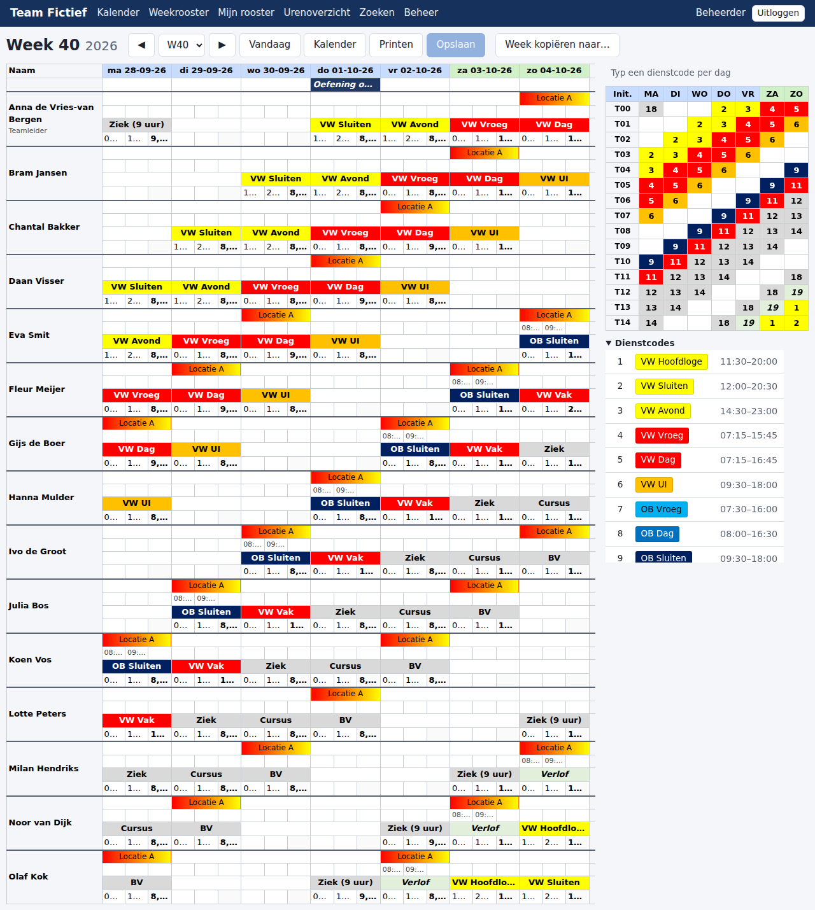
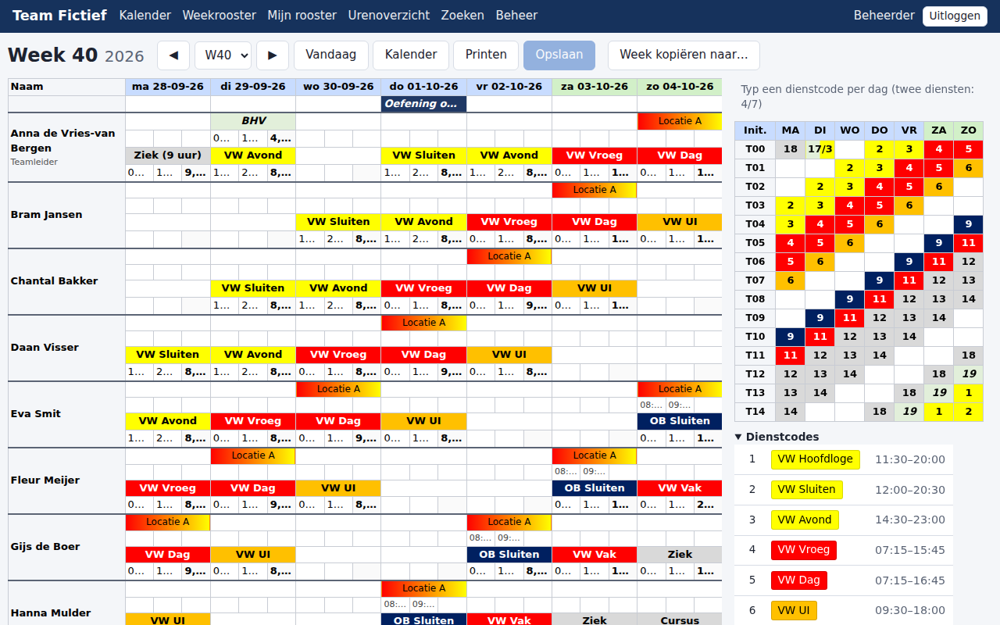
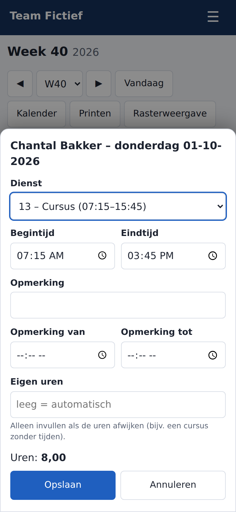
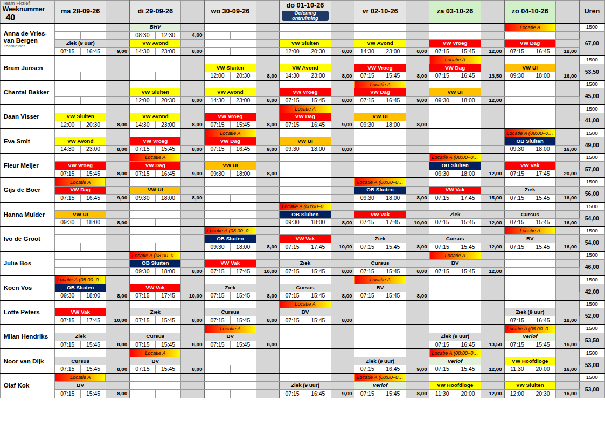

# Handleiding voor de planner (beheerder, versie 1.8.2)

Deze handleiding is voor wie het rooster invult. Als beheerder mag je alles; collega's met de rol *gebruiker* kunnen alleen kijken, printen en naar CSV exporteren (de Excel-export staat sinds 1.6.0 alleen in Beheer).

## 1. Een week invullen met het code-raster

Open **Weekrooster** (of klik in de **Kalender** op een weeknummer). Rechts van het rooster staat het **code-raster**: per medewerker één rij (initialen) en zeven kolommen MA t/m ZO. Op een smal scherm staat het code-raster onder het rooster.

1. Klik op een cel in het code-raster.
2. Typ het **nummer van de dienstcode**, bijvoorbeeld `4`, en druk op **Tab** (volgende dag) of **Enter** (volgende medewerker).
3. Direct gebeurt het volgende:
   - de dienstnaam verschijnt in het rooster, in de kleur van de code;
   - de standaard begin- en eindtijd van die code worden ingevuld;
   - de uren van die dag en het weektotaal worden berekend.

### Opslaan

Wijzigingen worden **niet** meteen opgeslagen. Wat je typt, zie je wel direct terug: de dienstnaam, de tijden en de uren worden al uitgerekend. Maar de gegevens worden pas bewaard als je op **Opslaan** klikt of **Ctrl+S** drukt. Zo richt een per ongeluk getypte waarde geen schade aan.

Zolang er iets niet is opgeslagen:
- hebben gewijzigde cellen een **oranje hoekje** en een oranje streep onderaan;
- staat er boven het code-raster "*N wijzigingen nog niet opgeslagen*";
- toont de knop het aantal, bijvoorbeeld **Opslaan (3)**.

Je kunt gewoon meerdere cellen achter elkaar wijzigen en dan één keer opslaan.

Wil je de pagina verlaten zonder op te slaan, bijvoorbeeld via het menu, een andere week, de weekkiezer of Uitloggen? Dan vraagt de app eerst wat je wilt:

| Knop | Wat gebeurt er |
|---|---|
| **Opslaan** | alles opslaan en daarna verder naar waar je heen wilde |
| **Terug** | terug naar het rooster om verder te wijzigen |
| **Doorgaan** | verder zonder opslaan: alle wijzigingen gaan verloren |

Sluit of ververs je de browser (of het tabblad) met niet-opgeslagen wijzigingen, dan toont de browser zijn eigen vraag ("Pagina verlaten?"). Browsers staan daar geen eigen knoppen toe, dus daar kun je alleen kiezen tussen blijven en verlaten.

Klikken in het rooster, printen en de uitklapbare lijsten (Dienstcodes, Toetsen) geven geen vraag.

| Wat je typt | Betekenis |
|---|---|
| een codenummer (`1`, `4`, `17`, …) | die dienst |
| niets (cel leeg maken met **Delete**) | geen dienst |
| de blanco-code (standaard `15`) | ook: geen dienst (voor wie gewend is aan Excel) |
| een onbekend nummer | rode cel met de melding "Onbekende dienstcode"; er wordt niets opgeslagen |
| twee codes, bijvoorbeeld `4/7` (ook `4+7` of `4 7`) | **twee diensten** op die dag, zie hieronder |

### Twee diensten op één dag

Werkt iemand op één dag twee diensten (bijvoorbeeld 's ochtends BHV en 's avonds VW Avond)?
Typ dan **twee codes** in dezelfde cel van het code-raster, gescheiden door `/`, `+` of een spatie:
`17/3`, `17+3` of `17 3`. Er kunnen er hooguit **twee** per dag.

- De cel toont `17/3` met een **gesplitste kleur**: links de kleur van dienst 1, rechts die van dienst 2.
- Er komen **geen extra regels** bij. Op die dag schuift **dienst 1 naar de bovenste twee
  regels** van het blok (dienstnaam, daaronder begin, eind en uren) en staat **dienst 2 op de
  onderste twee**. De andere dagen van die week blijven zoals ze waren.
- Elke dienst heeft **eigen tijden en uren**; je kunt ze los aanpassen in het rooster, net als
  bij één dienst. Pauze-aftrek en weekend-/feestdagtoeslag gelden per dienst. Het dag- en
  weektotaal tellen beide diensten op.
- De **opmerking** hoort bij de dag, niet bij een dienst. Op een dag met twee diensten staat
  ze achter de dienstnaam van dienst 1, bijvoorbeeld *VW Vroeg – Later op dienst*. Wijzigen
  kan pas weer als het één dienst is (bijvoorbeeld tijdelijk alleen `4` typen).
- Overlappen de tijden van de twee diensten? Dan zie je boven het code-raster een **oranje
  waarschuwing**. Opslaan kan gewoon; controleer even of het klopt.
- In het logboek staat bij wijzigingen aan de tweede dienst **"dienst 2:"** voor het veld.

**Tweede dienst weer weghalen:**

| Wat je typt in het code-raster | Gevolg |
|---|---|
| één code, bijvoorbeeld `17` | dienst 1 wordt `17`, dienst 2 verdwijnt |
| niets (**Delete**) | beide diensten verdwijnen |
| `/3` | alleen een tweede dienst (dienst 1 leeg) |
| `5/` | dienst 1 wordt `5`; een tweede dienst **met een vrije dienstnaam** (die in het raster als `4/` staat) blijft staan; een tweede dienst met een code verdwijnt |

Op de telefoon zie je de tweede dienst op de dagkaart. Het bewerkpaneel op de telefoon wijzigt
alleen dienst 1; kies je daar een andere dienst, dan verdwijnt dienst 2. Twee diensten invullen
of aanpassen doe je in het code-raster op de computer.

### Toetsen (zoals in Excel)

| Toets | Wat gebeurt er |
|---|---|
| Pijltjes, Tab / Shift+Tab, Enter / Shift+Enter | verplaatsen |
| Direct typen | cel overschrijven |
| F2 of dubbelklik | bestaande waarde bewerken |
| Esc | bewerken annuleren |
| Delete / Backspace | geselecteerde cellen leegmaken |
| Shift + pijltjes of Shift + klik | een blok cellen selecteren |
| Ctrl+C / Ctrl+V | kopiëren en plakken, ook een blok dat je in Excel hebt gekopieerd |
| Ctrl+Z | de laatste niet-opgeslagen wijziging(en) ongedaan maken |
| Ctrl+S | opslaan |

Plakken van één waarde terwijl een blok geselecteerd is, vult het hele blok (handig om een hele rij `4` te geven).

## 2. Tijden handmatig aanpassen

Wijkt een dienst af van de standaardtijden? Klik dan in het **rooster zelf** op de begin- of eindtijd (onderste regel van het blok) en typ de nieuwe tijd. Tijden mag je invoeren als `715`, `7:15`, `07.15` of `0715`; ze worden altijd `07:15`.

- De uren worden opnieuw berekend.
- Begin- en eindtijd mogen niet gelijk zijn (dat zou een dienst van 0 minuten zijn); je krijgt dan een melding. Een nachtdienst typ je gewoon met een eindtijd vóór de begintijd (22:00–06:30).
- Stonden er bij dienst 1 **zelf ingevulde uren** (bijvoorbeeld uit het oude Excel: dienst plus een training op de opmerkingregel, samen getypt als dagtotaal) en komt er een tweede dienst bij, dan vervallen die zelf ingevulde uren (sinds 1.6.0). Zo telt elke dienst zijn eigen uren en telt het tweede deel niet dubbel in het weektotaal. In het logboek staat de oude waarde. Dagen die nog uit een eerdere versie zo zijn blijven staan, vind je in *Beheer → Statistieken* onder *Mogelijk dubbel geteld*.
- Staan bij dienst 1 **opmerkingtijden** (bijvoorbeeld *Soc. Veiligh. OB 13:00–17:00*, zoals uit de import) en is *Opmerkingtijden meetellen* aan, dan tellen die tijden **niet** mee zodra ze samenvallen met de tweede dienst (sinds 1.8.2). Dat tijdvak telt dan alleen bij dienst 2. Opmerkingtijden op een ander moment van de dag tellen gewoon mee. De Excel-export rekent hetzelfde.
- Na de update naar 1.8.2 kijkt de app **één keer** alle dagen met een tweede dienst na en corrigeert dubbel getelde uren. Elke correctie staat in het logboek als *Uren gecorrigeerd* (met de oude en de nieuwe uren), plus één regel *Rooster nagekeken* met het aantal.
- Een handmatige tijd herken je aan de tip *Handmatig aangepast* als je er met de muis op staat. Hij blijft staan tot je de **dienstcode opnieuw wijzigt**; dan komen de standaardtijden van de nieuwe code terug.

### Vrije dienst en eigen uren

Niet elke dienst heeft een code. Bijvoorbeeld een cursus of een extra ronde.

- Typ in het rooster op de **dienstnaamregel** (regel c) een eigen naam. Een eventuele code vervalt dan.
- Wil je alleen iets **achter de dienstnaam** zetten (bijvoorbeeld *VW Vroeg – tot 12:00*)? Laat de dienstnaam dan vooraan staan en typ je aanvulling erachter (na een spatie of leesteken). De code, de kleur en de tijden blijven dan gewoon staan. Haal je de aanvulling weg, dan staat er weer alleen de dienstnaam (alleen hoofdletters anders, zoals *vw vroeg*, telt ook als de gewone naam). Een nieuwe code kiezen haalt de aanvulling ook weg. Hernoem je later de dienstcode, dan gaat de aanvulling mee: *VW Vroeg – tot 12:00* wordt *VW Ochtend – tot 12:00*.
- Typ in de **urencel** (rechts van de eindtijd) zelf het aantal uren, bijvoorbeeld `8` of `7,5`. Zelf ingevulde uren:
  - gaan voor de berekening;
  - krijgen geen weekendtoeslag;
  - hebben dezelfde rode markering.
- **Delete** op de urencel zet de uren weer op automatisch.
- Een nieuwe dienstcode invoeren maakt de uren ook weer automatisch.

## 3. Opmerkingen

Elk medewerkerblok heeft vier regels per dag (bij twee diensten op een dag is de indeling anders, zie 1):

| Regel | Inhoud | Telt mee in uren? |
|---|---|---|
| a | opmerking (bijvoorbeeld "BV", "BHV", "Later op dienst") | nee |
| b | begin- en eindtijd bij de opmerking (bijvoorbeeld BV 13:30–15:45) | nee (instelbaar bij Instellingen) |
| c | dienstnaam (komt van de dienstcode) | – |
| d | begin, eind en uren van de dienst | **ja** |

Een opmerking die precies overeenkomt met een **kleurregel** (bijvoorbeeld een locatienaam) krijgt automatisch de kleur van die regel (*Beheer → Dienstcodes → Opmerking-kleurregels*).

**Dagopmerking** (de balk onder de datums): wordt automatisch gevuld met feestdagen en vakanties. Een feestdag gaat voor een vakantie, en vakanties staan alleen op werkdagen. Je kunt de tekst overschrijven:

- **Typen**: eigen tekst.
- **Delete** op een eigen tekst: de automatische tekst komt terug.
- **Delete** op een automatische tekst: de dagopmerking wordt verborgen.

## 3a. Op de telefoon een dienst wijzigen

Op een telefoon (of als je **Telefoonweergave** kiest) zie je het weekrooster als kaarten: **Per dag** (één dag, het hele team) of **Per medewerker** (zeven dagen). Blader met ◀ ▶ of door te vegen.

1. Tik op de kaart van een medewerker op een dag. Er schuift een paneel omhoog.
2. Kies de **dienst** uit de lijst (met omschrijving en standaardtijden). De begin- en eindtijd worden ingevuld en je ziet direct de **uren**.
3. Pas zo nodig de **begin- en eindtijd**, de **opmerking** (met tijden) of de **eigen uren** aan. Eigen tijden worden, net als in het raster, gemarkeerd als *handmatig aangepast*.
4. Tik op **Opslaan**. Het paneel sluit en de kaart toont de nieuwe dienst.

Het opslaan werkt precies zoals in het raster: heeft een andere planner dezelfde dag intussen gewijzigd, dan krijg je een melding en wordt er niets overschreven (zie 10). Ga je weg met niet-opgeslagen wijzigingen, dan krijg je eerst de vraag *Opslaan / Terug / Doorgaan*.

Het Excel-achtige raster met toetsenbord blijft op de computer precies hetzelfde. Op een tablet kun je met **Rasterweergave** / **Telefoonweergave** wisselen; je keuze wordt per gebruiker onthouden.

## 4. Week kopiëren

Klik op **Week kopiëren naar…**, kies de doelweek en of je de hele week of één medewerker wilt kopiëren. De doelweek wordt **gelijk gemaakt** aan deze week: daar bestaande diensten worden overschreven. Tweede diensten gaan mee. In het logboek staat elke gewijzigde dienst apart, met de oude en de nieuwe waarde.

## 4a. Roosterpatronen (sinds 1.6.0)

Draait het team een vaste cyclus, bijvoorbeeld 8 weken? Leg die dan één keer vast in *Beheer → Roosterpatronen* en rol hem uit over meer weken en collega's.

1. **Nieuw patroon**: geef een naam en het aantal weken (1 t/m 12, standaard 8). Vul per week en dag de code in zoals in het code-raster: `4`, twee diensten als `4/7`, leeg = vrij. Klik op *Aantal weken toepassen* als je het aantal weken wijzigt. Een onbekende code geeft een melding; er wordt dan niets opgeslagen.
   - **Week kopiëren**: onder het raster kies je een bronweek en vink je de weken aan waar hij naartoe moet (bijvoorbeeld week 1 naar 3, 5 en 7) en klik je op *Kopiëren*. Die weken worden precies gelijk aan de bronweek (een lege dag wordt ook leeg). Er is dan nog niets opgeslagen: controleer en klik op *Opslaan*.
2. Of maak een **sjabloon uit het rooster**: kies een medewerker en de weken (hooguit 12), bijvoorbeeld W10 t/m W17. Je krijgt het patroon eerst te zien en slaat het zelf op. Diensten zonder code (een vrije dienstnaam) tellen als vrij.
3. **Uitrollen…**: kies de medewerkers en per medewerker de **startpositie** in de cyclus (1 = week 1 van het patroon in de startweek, 2 = week 2, …). Zo draaien acht collega's elk een andere week van hetzelfde patroon. Kies de startweek en een eindweek of -datum, en:
   - **Overschrijven**: elke dag wordt precies het patroon; een vrije dag in het patroon wist de dienst van die dag. **Alleen lege dagen aanvullen**: een dag die al een dienst heeft, wordt overgeslagen.
   - **Feestdagen** invullen of overslaan (dan blijft de feestdag zoals hij is).
   - Een gearchiveerde medewerker krijgt niets op of na de archiefdatum.
   - De **opmerking** van een dag (regel a en b) blijft altijd staan; een dag met alleen een opmerking telt als leeg.
   - Een patroon onthoudt de **codenummers**. Staat een code in een patroon, dan kun je die code in *Beheer → Dienstcodes* niet hernummeren of verwijderen (de melding noemt de patronen); deactiveren kan wel. Pas dan eerst het patroon aan.
4. **Voorbeeld bijwerken** toont per medewerker hoeveel diensten nieuw, vervangen, verwijderd, ongewijzigd en overgeslagen zijn. Er is dan nog niets gewijzigd.
5. Vink de bevestiging aan en klik op **Definitief toepassen**. Dat kan alleen met precies de keuzes van het voorbeeld. Is het patroon intussen gewijzigd (bijvoorbeeld door een andere beheerder), dan verandert er niets en zie je *gewijzigd sinds het voorbeeld; controleer het bijgewerkte voorbeeld*. Heeft een planner tegelijk een dienst in de periode gewijzigd, dan wordt ook alles teruggedraaid, met een melding wie en welke dag. Er wordt eerst een back-up gemaakt (*voor-patroon*), alles gebeurt in één keer, met de standaardtijden van de codes, de uren, een logboekregel per gewijzigde dienst en Google Agenda alleen voor de geraakte collega's. Nogmaals toepassen verandert niets.

### Rooster herhalen (een 8-wekelijks rooster voor het hele team, sinds 1.7.0)

Plan je liever gewoon in het weekrooster? Vul dan één keer de weken van de cyclus in (bijvoorbeeld 8 weken voor alle collega's) en klik in *Beheer → Roosterpatronen* op **Rooster herhalen…**:

1. Kies de **eerste bronweek** en de **cyclus** (aantal weken, standaard 8).
2. Kies vanaf welke week je wilt vullen en t/m welke week of datum, en de collega's. Standaard staan alleen de collega's aangevinkt die dan nog in het rooster staan **én** minstens één dienst in de bronweken hebben. Vink je toch iemand zonder diensten in de bronweken aan, dan waarschuwt het voorbeeld: bij *Overschrijven* wordt in de doelperiode alles van die collega gewist.
3. Elke collega krijgt zijn eigen rooster uit de bronweken, steeds herhaald. De cyclus loopt door: 8 weken na bronweek 1 komt weer bronweek 1, ook als je bijvoorbeeld 11 weken later begint (dan begin je in week 4 van de cyclus; dat staat in het voorbeeld). Ook weken vóór de bronweken kunnen zo gevuld worden. De periode mag de bronweken zelf niet overlappen.
4. Kies **wat er gekopieerd wordt**:
   - **Alleen codes** (standaard, zoals een patroon): diensten krijgen de standaardtijden van hun code; een dienst zonder code (vrije dienstnaam) telt als vrij en staat als waarschuwing in het voorbeeld. De opmerking van de dag blijft staan, zoals bij uitrollen.
   - **Exact kopiëren (zoals Week kopiëren)**: elke dag wordt precies de brondag, met afwijkende tijden, zelf ingevulde uren, vrije dienstnamen en de opmerking. Bij *Overschrijven* maakt een lege brondag de dag leeg (ook de opmerking); bij *Alleen lege dagen aanvullen* krijgt alleen een dag zonder dienst de brondag en wist een lege brondag niets.
   - Modus, feestdagen en archiefdatum werken in beide gevallen zoals bij uitrollen.
5. **Voorbeeld bijwerken**, bevestiging aanvinken en **Definitief toepassen**. Vooraf komt er een back-up (*voor-herhalen*); in het logboek staat *Rooster herhaald* en elke gewijzigde dienst. Is het rooster in de bronweken intussen gewijzigd, dan verandert er niets en zie je eerst het bijgewerkte voorbeeld.

## 5. Printen

Klik op **Printen**. De week komt liggend op één A4 (ook met 15 medewerkers, en ook als je vanaf een telefoon print), zonder het code-raster en met kleuren. Kies in het printvenster eventueel "Achtergrondafbeeldingen afdrukken" als de kleuren ontbreken.

De print ziet eruit als het vertrouwde papieren rooster:

- bovenaan *Weeknummer*, per dag de datum (`ma 28-09-26`) met eventueel de dagopmerking als donker label, en rechts de kolom *Uren*;
- per medewerker één blok met een dikke lijn ertussen: bovenin de opmerking, daaronder de dienstnaam als gekleurde balk en dan begin en eind; op een dag met twee diensten staat dienst 1 bovenin en dienst 2 eronder (net als op het scherm);
- de uren per dag in de smalle grijze kolom naast elke dag;
- rechts de contracturen en, grijs, het weektotaal;
- zaterdag en zondag staan er altijd op, ook als ze leeg zijn.

**Hoeveel past er op één A4?** De app meet de print echt op (ook lange namen, functies en dagopmerkingen tellen mee), dus er komt nooit één losse medewerker op een extra pagina terecht. Tot en met **10 medewerkers** past de week altijd op één pagina, ook als iedereen elke dag twee diensten heeft. Bij meer medewerkers worden eerst de regels lager en daarna de letters iets kleiner, zodat het zo lang mogelijk op één pagina blijft (bijvoorbeeld 13 medewerkers met overal twee diensten). Past het dan nog niet, dan wordt het **meer pagina's** met **hooguit 10 medewerkers per pagina** (14 = 10 + 4, 25 = 10 + 10 + 5):

- elke pagina begint weer met *Weeknummer* en de datums van de week;
- een medewerker staat altijd helemaal op één pagina (nooit dienst 1 op de ene en dienst 2 op de volgende pagina).

## 6. Kalender, overzichten en zoeken

- **Kalender** is de jaarkalender. Klik op een weeknummer of dag om die week te openen. Met "Zoek datum" (`dd-mm` of `dd-mm-jjjj`) spring je naar een dag; die dag wordt geel gemarkeerd. Rechts staan het **overzicht** (contracturen, gewerkte uren, verschil) en de **roostervrije dagen**.
- **Urenoverzicht**: alle weektotalen van het jaar per medewerker. De huidige week is groen. Klik op een getal om die week te openen. Exporteren als CSV kan ook; naar Excel exporteren doe je in *Beheer → Excel import/export*.
- **Zoeken**: zoek op naam of initialen (minimaal 3 tekens) of op dienstcode, eventueel binnen een periode. Diensten met afwijkende tijden krijgen de markering *afwijkend*. Er worden hooguit 5000 diensten getoond (ook in de export); is het er meer, dan staat dat er duidelijk bij.

### Rooster exporteren naar Excel

Sinds 1.6.0 staat de Excel-export onderaan **Beheer → Excel import/export** (alleen voor de beheerder). Kies één van:

| Keuze | Bestandsnaam |
|---|---|
| **Eén week** (jaar + week 1 t/m 52/53) | `rooster-2026-W10.xlsx` |
| **Een vrije periode** (van – t/m, binnen één roosterjaar) | `rooster-20260302-20260315.xlsx` |
| **Een heel jaar** | `rooster-2026.xlsx` |
| **Het jaarrooster van één persoon** | `rooster-2026-ma.xlsx` (de initialen) |

Bij een week, periode of jaar kun je ook één medewerker kiezen. Een periode moet binnen één roosterjaar (ISO-weken) vallen: het bestand heeft één blad per weeknummer en blijft zo weer in te lezen. Een ongeldige keuze geeft een melding op het scherm.

Het bestand lijkt op het oude Excel-rooster:

- per week een blad **W1…W53** zoals het weekrooster: per medewerker de opmerking, de opmerkingtijden, de dienstnaam (in de kleur van de code) en begin, eind en uren; rechts de contracturen en het weektotaal, en het code-raster. Een **tweede dienst** op een dag staat rechts, vanaf kolom AK (*2e dienst*);
- een blad **Lijsten** (medewerkers, contracturen, dienstcodes en de instellingen voor de uren: toeslagen in N2–N4, opmerkingtijden N5, pauze N6 en N9:O13), **Feestdagen**, **Urenoverzicht**, **Vakanties** (met het aantal werkdagen) en **Kalender** (met het jaar).

**Het werkt in Excel zoals de app** (gewone `.xlsx`, geen macro's):

- De **uren** zijn een formule: begin- en eindtijd, de pauze uit de staffel, × de toeslag van de dag (zaterdag, zondag, feestdag: de hoogste telt), afgerond op kwartieren precies zoals de app (ook bij precies een half kwartier). Wijzig je in Excel een tijd, dan rekent Excel de uren en het **weektotaal** opnieuw uit; het **urenoverzicht** verwijst naar de weektotalen.
- Volgt een dienst de standaard van zijn code, dan zoeken **dienstnaam en tijden** de code uit het code-raster op in *Lijsten*. Typ je in Excel een andere code (ook `4/7`), dan veranderen naam, tijden en uren mee. Afwijkende tijden, een eigen dienstnaam of een aanvulling achter de naam zijn vaste waarden. Het 2e-dienstblok heeft alleen formules op dagen die al een tweede dienst hebben (zo blijft een jaarbestand klein en snel); een nieuwe tweede dienst voeg je in de app toe.
- **Zelf ingevulde uren** blijven een vaste waarde: rood, met een opmerking in de cel.
- Het verborgen blad *Rekenhulp* zorgt dat Excel bij een half kwartier of precies op een pauzegrens precies zo afrondt als de app (die volgt de kommagetallen van de oude Excel-macro). Wijzig je in Excel de pauzeregels, dan rekent Excel daarna exact, zonder die correctie. Wijzig instellingen dus liever in de app en exporteer opnieuw. De opmerkingtijden tellen in Excel alleen mee als dat bij de export al aan stond.

Je kunt het bestand later weer **importeren** (zie 8), ook als je het in Excel hebt geopend en opgeslagen. Diensten, tijden, opmerkingen, uren, tweede diensten, dienstcodes en contracturen komen dan precies terug; uren uit een formule tellen niet als *zelf ingevuld*. Wat **niet** terugkomt: de kleuren van dienstcodes en kleurregels, e-mailadressen, archiefdatums, agendakoppelingen, de pauzestaffel en de instellingen van feestdagen. Tekst die met `=`, `+`, `-` of `@` begint, staat in het bestand als gewone tekst (nooit als formule). Elke export komt in het logboek.

Het **jaartotaal** telt de ISO-weken W1 t/m W52/W53 van dat jaar, net als in Excel. Week 1 van 2026 begint dus op maandag 29-12-2025.

## 7. Beheer

| Scherm | Wat |
|---|---|
| Medewerkers | toevoegen, initialen (worden voorgesteld), contracturen per jaar, functie, e-mail, volgorde (▲▼), archiveren of verwijderen |
| Dienstcodes | nummer, omschrijving, standaardtijden, kleuren (met live voorbeeld), agenda-instellingen; voorbeeldpakket; kleurregels voor opmerkingen |
| Vakanties | naam, van en tot; het aantal werkdagen wordt berekend |
| Feestdagen | per jaar automatisch; aan of uit zetten; eigen roostervrije dagen toevoegen (met een feestdagtoeslag krijg je daarna de tip *Alle uren herberekenen*) |
| Gebruikers | accounts, rollen, koppeling met een medewerker, wachtwoord resetten |
| Instellingen | teamnaam, toeslagen, pauze (aan/uit en een staffel), blanco-code, logboek-bewaartermijn, alleen-lezen deellink (toont het rooster met dienstnamen, tijden en uren per dienst, maar geen contracturen, weektotalen, urenoverzicht of exports) |
| Logboek | elke wijziging met wie, wanneer, oud en nieuw; te filteren. Ook bij week kopiëren, standaardtijden toepassen, de Excel-import en het verwijderen van een medewerker staat elke gewijzigde dienst apart |
| Uren herberekenen | na het wijzigen van toeslagfactoren, de pauze of feestdagen |
| Excel import/export | een rooster inlezen (zie 8) of exporteren (zie 6) |
| Roosterpatronen | zie 4a |
| Statistieken | zie hieronder |

### Statistieken (sinds 1.6.0)

*Beheer → Statistieken* is een alleen-lezen overzicht:

- **Google Agenda**: collega's bij wie de synchronisatie mislukte (met de melding en het tijdstip van de laatste geslaagde sync), de wachtrij (wachtend, bezig, mislukt) en de oudste wachtende taak, met *Mislukte opnieuw proberen*.
- **Back-ups**: de laatste geslaagde automatische back-up en de laatste met een label, het aantal en de totale grootte, en de laatste mislukte back-up. Is de laatste automatische back-up ouder dan 2 dagen, dan staat er een waarschuwing (draait de worker?).
- **Rooster**: het aantal diensten dit jaar, per medewerker de uren t/m deze week tegenover de contracturen naar rato, diensten met zelf ingevulde uren of afwijkende tijden, en dagen met een tweede dienst naast zelf ingevulde uren bij dienst 1 (mogelijk dubbel geteld).
- **Beveiliging**: mislukte inlogpogingen en blokkades van de laatste 24 uur, en de actieve API-tokens.

Zijn er syncfouten, is de back-up te oud of telt een dag mogelijk dubbel, dan zie je dat ook kort bovenaan de Beheer-startpagina.

### Archiveren of verwijderen?

- **Archiveren** (aanbevolen bij vertrek): de medewerker verdwijnt uit de weken vanaf de gekozen datum. Oude diensten en uren blijven bewaard en zichtbaar in oude weken. Een ongeldige datum geeft een melding (er wordt dan niets gearchiveerd).
- **Verwijderen**: alleen zonder diensten, of na een expliciete bevestiging dat alle diensten ook verdwijnen.

### Standaardtijden van een code wijzigen

Een nieuwe standaardtijd geldt alleen voor **nieuwe invoer**. Wil je ook de toekomstige diensten aanpassen? Gebruik dan bij de code **Tijden toepassen…**. Je ziet eerst hoeveel diensten er veranderen.

### Toeslagen wijzigen

Uren worden berekend op het moment van opslaan. Heb je de factor voor zaterdag of zondag gewijzigd, gebruik dan **Uren herberekenen**. Let op: dat verandert ook historische totalen.

### Pauze instellen

In *Beheer → Instellingen*, blok **Pauze**: zet de pauzeaftrek aan of uit en vul één of meer regels in: *meer dan X uur gewerkt → Y uur pauze eraf* (hooguit 5, grenzen oplopend, pauze kleiner dan de grens). Voorbeeld: meer dan 5,5 uur → 0,5; meer dan 9 uur → 0,75. De **hoogste regel** die van toepassing is telt (de pauzes worden niet opgeteld); precies op de grens telt niet. De pauze geldt per dienst, ook bij twee diensten op één dag. Standaard staat er precies wat het oude Excel deed: meer dan 5,5 uur → 0,5. Na een wijziging zie je de tip *Alle uren herberekenen*; in het logboek staan de oude en de nieuwe regels.

Let op een eigenaardigheid die de app bewust van de oude Excel-macro overneemt: die rekent met kommagetallen, en een dienst van **precies** de grens (bijvoorbeeld 13:00–18:30, precies 5,5 uur) komt daardoor bij sommige begintijden net boven de grens uit en krijgt dan wél pauze. Zo blijven de uren gelijk aan die uit het oude bestand.

## 8. Een Excel-bestand importeren

Je kunt het oude `Rooster_2026.xlsm` inlezen, of een bestand dat je eerder uit de app hebt geëxporteerd.

1. Ga naar *Beheer → Excel import/export* en upload het bestand bij **Importeren**.
2. Kies **Rooster voor jaar** (verplicht). Het voorstel komt uit het bestand (*Kalender*, cel E2) of uit de bestandsnaam (`rooster-2027.xlsx`). Zo kun je ook het rooster van **volgend jaar** importeren naast het huidige. Alleen dat jaar wordt gevuld; **andere jaren blijven gegarandeerd ongemoeid**. Klopt het gekozen jaar niet met het bestand, dan zie je een waarschuwing, en weekbladen met datums uit een ander jaar worden overgeslagen.
3. Je ziet een **voorbeeld** (er is nog niets opgeslagen) en kiest **wat er overschreven wordt**:
   - **Alles in het gekozen jaar**: alle diensten van de medewerkers uit het bestand worden vervangen, maar alleen in de **weken die in het bestand staan**. Weken zonder blad blijven zoals ze zijn.
   - **Gedeeltelijk**: kies één of meer **medewerkers** en/of een **periode**. Alleen diensten die aan beide voldoen worden gewist en opnieuw ingevuld; de rest blijft precies staan. Geen medewerker = iedereen; geen periode = het hele jaar.
   - **Alleen lege dagen aanvullen**: er wordt niets overschreven. Heeft een medewerker op een dag al een dienst of opmerking, dan wordt die dag overgeslagen.

   **Dagopmerkingen** volgen de periode. Kies je medewerkers, dan blijven ze standaard ongemoeid (ze gelden voor iedereen), tenzij je *Dagopmerkingen ook overnemen* aanvinkt.

   Per **algemeen onderdeel** kies je *overnemen* of *niet overnemen*: contracturen (alleen voor het gekozen jaar), toeslagen, vakanties (alleen die in dat jaar vallen) en nieuwe dienstcodes. Bestaande dienstcodes worden **nooit** gewijzigd. Let op: **toeslagen gelden voor alle jaren**; daarom worden ze voor een ander jaar dan het huidige standaard niet overgenomen.
4. Klik op **Voorbeeld bijwerken**. Je ziet per medewerker hoeveel diensten er **nieuw** zijn, **vervangen** en **verwijderd** worden (bestaande diensten), en hoeveel ongewijzigd blijven of overgeslagen worden; daaronder welke dagopmerkingen veranderen. Verder:
   - diensten met afwijkende tijden en de controle van alle weektotalen tegen Excel;
   - uren die in Excel met de hand zijn aangepast (bijvoorbeeld een dienst tot 13:00 met daarna een training, waarbij de uren van de hele dag zijn getypt). Die worden overgenomen als *zelf ingevulde uren*, zodat de totalen precies overeenkomen met Excel.
5. Vink de bevestiging aan en klik op **Definitief importeren**. Dat kan alleen met **precies de keuzes van het getoonde voorbeeld**; heb je intussen iets veranderd, dan krijg je eerst het nieuwe voorbeeld te zien. Er wordt eerst automatisch een back-up gemaakt, en de import gebeurt in één keer (alles of niets).

Na de import worden alleen de **geraakte medewerkers** opnieuw met Google Agenda gesynchroniseerd. Verwijderde diensten met een afspraak verdwijnen ook uit Google. Nogmaals importeren met dezelfde keuzes verandert niets (geen dubbele diensten). In het logboek staan het jaar, de modus, de medewerkers, de periode, de aantallen en elke gewijzigde dienst.

## 9. Back-ups

*Beheer → Back-ups*: nu een back-up maken, downloaden, terugzetten of **verwijderen** (met bevestiging; komt in het logboek). Bij het terugzetten wordt de huidige stand eerst bewaard als veiligheidsback-up. Elke nacht maakt de app zelf ook een back-up. Na het terugzetten moet iedereen opnieuw inloggen, en werken bestaande API-tokens niet meer. De Google Agenda van alle gekoppelde medewerkers wordt daarna opnieuw gesynchroniseerd, zodat de agenda's weer bij het teruggezette rooster passen.

Werkt de website niet meer, maar draait de container nog? Dan kan het ook op de server: `docker compose exec -u rooster web flask terugzetten <naam-van-de-back-up>`.

## 10. Twee planners tegelijk

Heeft een andere beheerder dezelfde dag van dezelfde medewerker al opgeslagen terwijl jij er nog mee bezig bent? Dan krijg je bij die cel een melding en wordt jouw wijziging daar niet opgeslagen. Ververs de pagina om de nieuwste stand te zien. Er gaat niets stilletjes verloren.

Dat geldt ook voor de Excel-import, het uitrollen van een patroon en Rooster herhalen: wijzigt iemand tijdens het toepassen een dienst die daarin zit, dan wordt alles teruggedraaid en zie je welke medewerker en dag het betreft. Bekijk het bijgewerkte voorbeeld en pas opnieuw toe.

## 11. Telefoon, app en API

- De hele site werkt op de telefoon; via **https://** kun je hem als app op het beginscherm zetten (Android: *App installeren*, iPhone: *Zet op beginscherm*). Zie de [handleiding voor collega's](handleiding-collega.md#als-app-op-je-beginscherm).
- Elke gebruiker kan zelf **API-tokens** maken voor een app (*naam rechtsboven → API-token*). Een token kan alleen lezen, met dezelfde rechten als het account. Het aanmaken en intrekken staat in het logboek. Een wachtwoordreset, deactiveren of een back-up terugzetten maakt de tokens van die gebruiker (of van iedereen) ongeldig. Zie [api.md](api.md) en [app.md](app.md).
